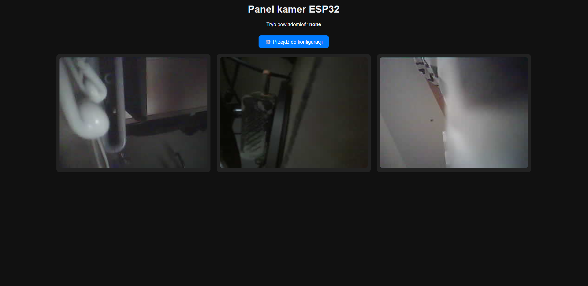
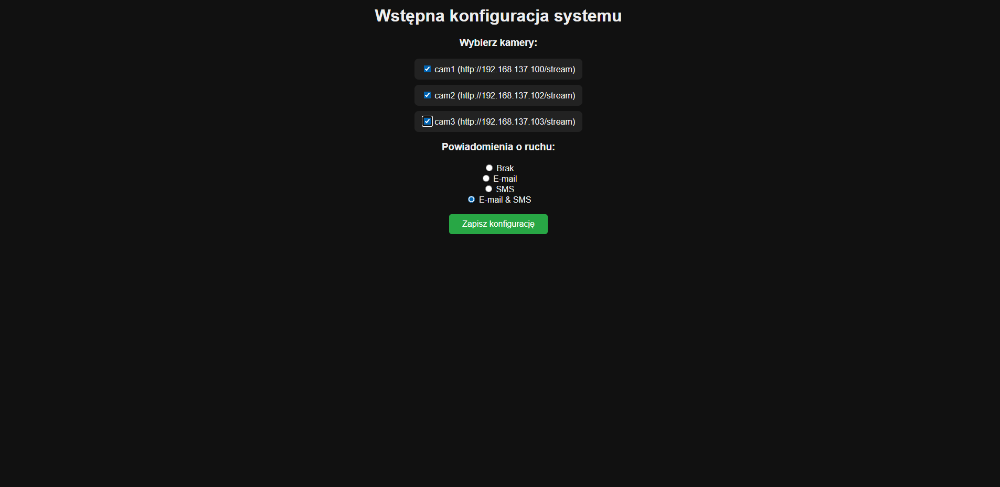

# engineering-thesis-esp32-monitoring
Engineering thesis project focused on designing and implementing a multipoint monitoring system for residential environments. This project implements a multipoint monitoring system designed for residential environments. Camera images from distributed ESP32-based stations are transmitted to a central HTTP server, where they are visualized, configured, and archived. The system supports motion detection and can notify the user about detected events via SMS and email.

In addition to live camera preview, the system provides image storage from monitoring stations and event logging on the server side, enabling later review of detected activity. The solution is highly configurable and can operate locally without the use of cloud services.

The system is intended for a wide range of applications, including areas where immediate user notification about detected motion is required, as well as scenarios where only live video preview is needed, such as monitoring a home or supervising pets left alone. These functionalities can operate simultaneously.
The implemented solution meets the initial design assumptions and remains open to further hardware and software expansion.

## System Overview:

System overview diagram illustrating a multipoint monitoring architecture. Multiple ESP32-S3 Sense camera stations equipped with PIR motion sensors detect movement and transmit data via WiFi/HTTP to a central Flask server. The server handles image storage, event logging, configuration management, and camera preview endpoints, and can notify the user via SMS or email.

## System Components:

### Hardware
- **ESP32-S3 Sense**  
  Main microcontroller unit responsible for camera operation, motion detection logic, WiFi communication, and power management.

- **OV3660 Camera Module**  
  Integrated camera used for image capture and MJPEG video streaming.

- **HC-SR501 PIR Motion Sensor**  
  Passive infrared sensor used to detect motion events and trigger image capture.

- **External U.FL WiFi Antenna**  
  Improves wireless communication range and reliability.

- **Power Supply (5V / USB)**  
  Provides power to the ESP32-S3 board and connected peripherals.

Hardware connection diagram of a single monitoring station based on the ESP32-S3 Sense and HC-SR501 PIR motion sensor. The PIR sensor is powered from the ESP32 board and connected to a GPIO pin used for motion detection. An external U.FL antenna is used to improve WiFi communication reliability.

## Software
- **ESP32 Firmware (C/C++)**  
  Handles WiFi connectivity, camera control, PIR interrupt processing, HTTP communication, and power-saving modes.

- **Flask HTTP Server (Python)**  
  Central server responsible for image storage, event logging, configuration endpoints, and camera preview streams.
  Sends SMS and/or email notifications when motion is detected.

- **Web Interface (HTML/CSS)**  
  Provides live camera preview, system configuration, and access to stored snapshots.

## Web Interface

The system provides a web-based user interface that allows real-time monitoring and configuration of all connected ESP32 camera stations.  
The main dashboard presents **live camera previews** from multiple monitoring nodes simultaneously, enabling quick visual inspection of the monitored areas.

A dedicated configuration view allows the user to perform **initial system setup**, including selecting active cameras and defining the preferred **motion notification method** (none, email, SMS, or both). Configuration changes are saved on the server and applied dynamically without restarting the system.

