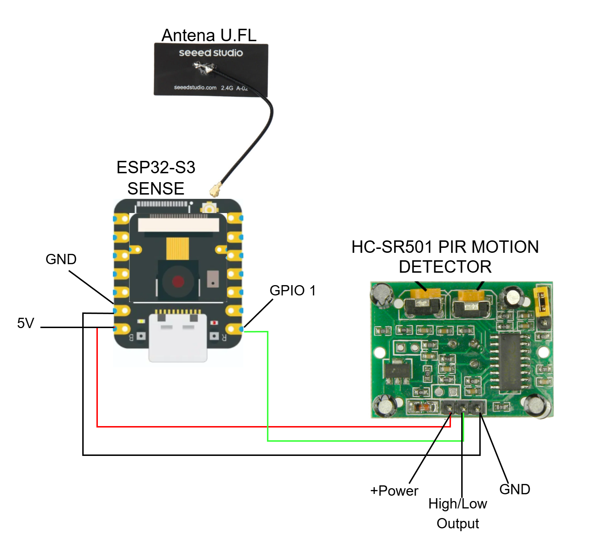
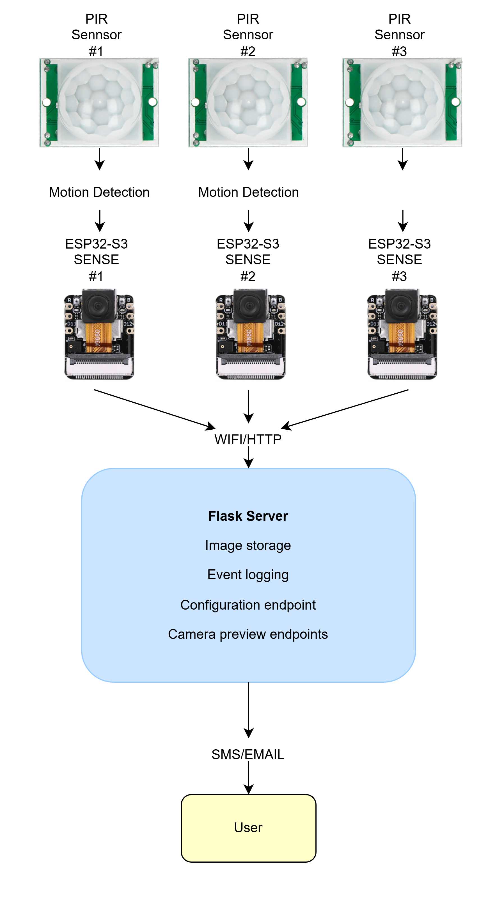

# engineering-thesis-esp32-monitoring
Engineering thesis project focused on designing and implementing a multipoint monitoring system for residential environments. The system is built using ESP32-S3 microcontrollers, PIR motion sensors, and a central HTTP server with live video preview and event notification capabilities.

